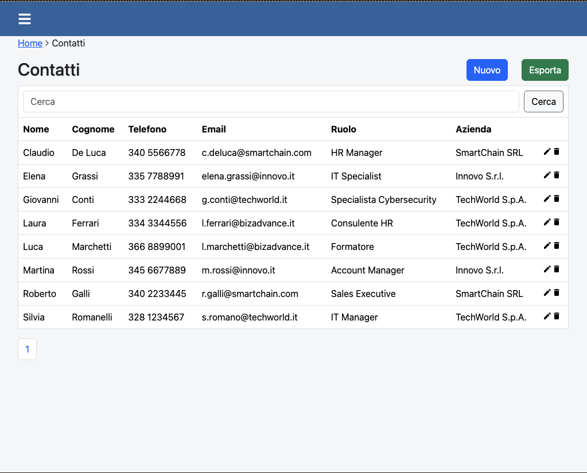
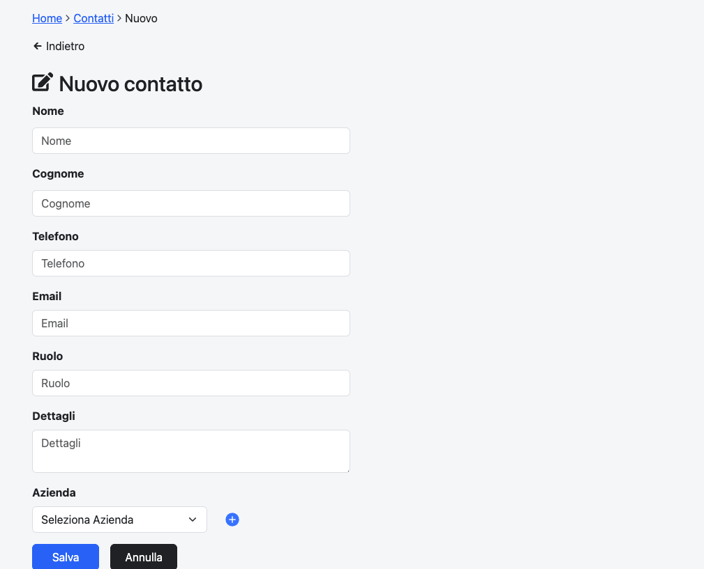
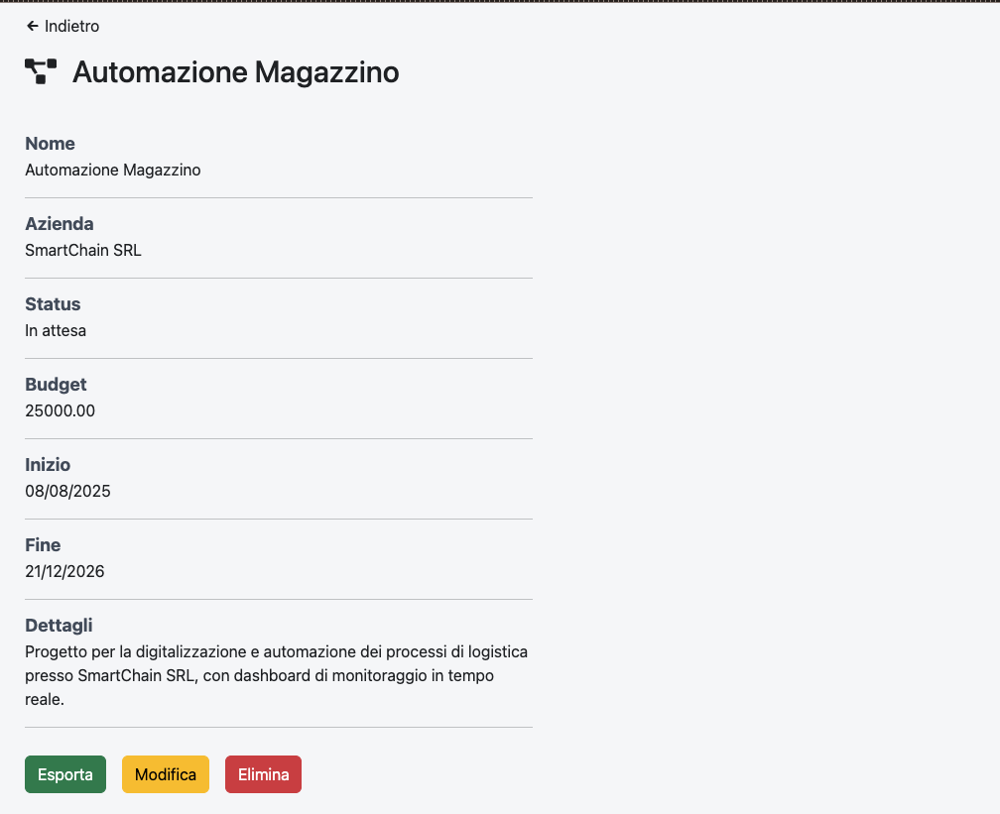
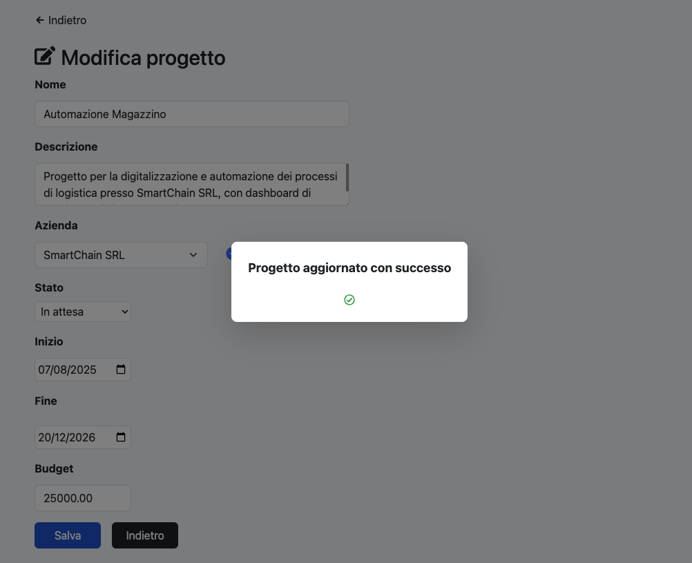
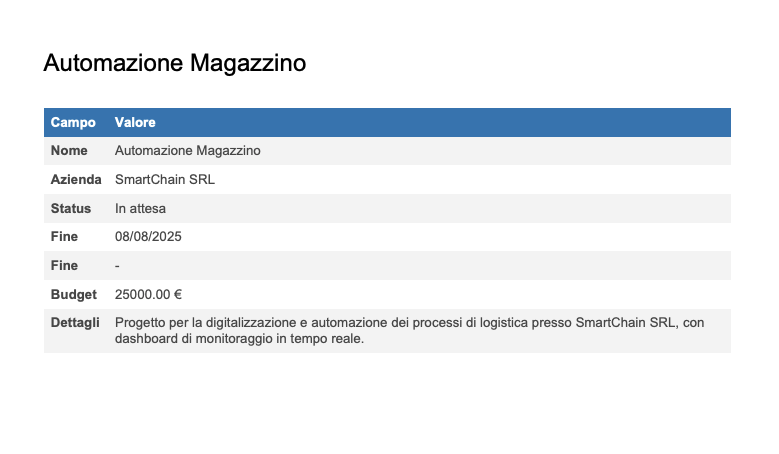

# 📇 Web App CRM – Gestione Contatti, Aziende e Progetti

Una **web app semplice e intuitiva** per gestire:
- ✅ Liste personali di **contatti**
- ✅ Anagrafiche di **aziende**
- ✅ **Progetti** collegati a contatti e aziende  

Pensata per **Sales, Marketing e HR**, che vogliono uno strumento leggero e veloce.

---

## Funzionalità principali
- 👩‍💻 CRUD completo per contatti, aziende e progetti  
- 🔎 Ricerca rapida 
- 🔗 Collegamenti tra entità (contatto ↔ azienda, progetto ↔ azienda)  
- 📱 Frontend in **React** con interfaccia responsive, SPA reattiva e moderna.
- ⚙️ Backend in **Node.js + Express + PostgreSQL**

---

## Screenshot

*(Esempio di schermata della dashboard con lista contatti)*

*(Esempio di schermata della pagina per creare un nuovo contatto)*

*(Esempio di schermata della pagina con la vista dei dettagli di un singolo progetto)*

*(Esempio di schermata della pagina di aggiornamento di un singolo progetto)*

*(Esempio di PFD con l'export dei dettagli di un singolo progetto)*

---

## ⚙️ Tecnologie utilizzate
- **Frontend**: React, Vite , Tailwind per la stilizzazione rapida e inline dei componenti, Bootstrap per le tabelle ed i bottoni
- **Backend**: Node.js, Express  
- **Database**: PostgreSQL  

