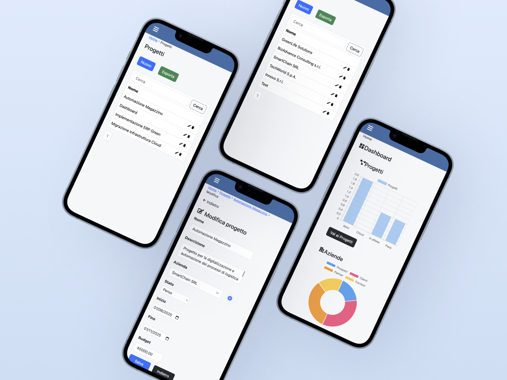
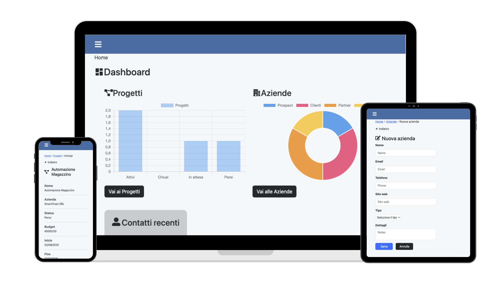
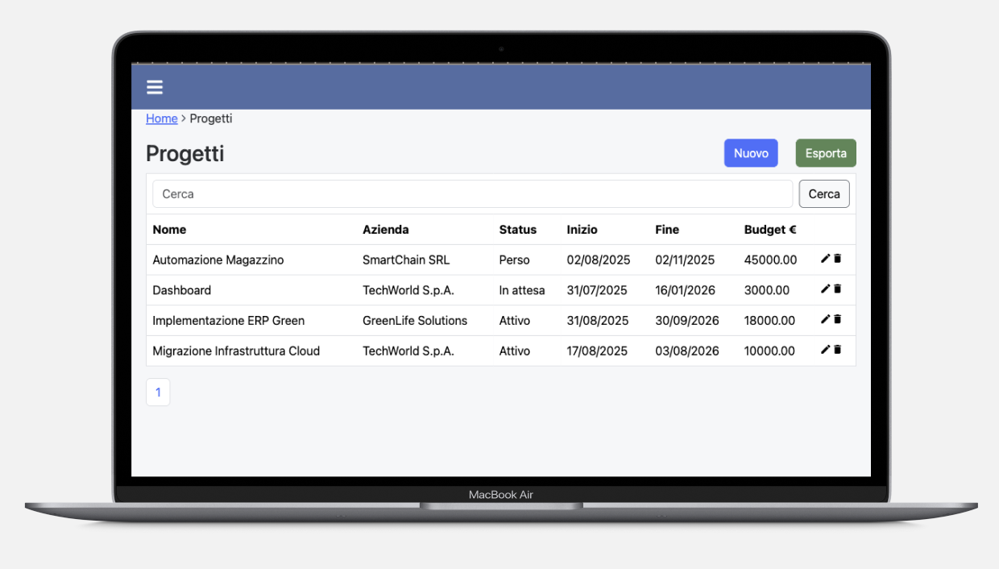

# Web App CRM – Gestione Contatti, Aziende e Progetti

Una **web app semplice e intuitiva** per gestire:
- ✅ Liste di **contatti**
- ✅ Anagrafiche di **aziende**
- ✅ **Progetti** collegati a contatti e aziende  

Pensata per **Sales, Marketing e HR**, che vogliono uno strumento leggero e veloce.

**Branch attivo:** `bootstrap`  
Versione responsive con interfaccia basata su Bootstrap e stile mobile-first.

---

## Immagini dimostrative

| Descrizione | Screenshot |
|-------------|-------------|
| UI responsiva |  |
| Creazione, visualizzaizone, modifica di liste |  |
| Vista Progetti |  |
| Export PFD |  |


---

## Requisiti

Assicurati di avere installato:
- [Node.js](https://nodejs.org/) v18+
- [npm](https://www.npmjs.com/)
- [PostgreSQL](https://www.postgresql.org/) v15+

- E' necessaria una consocenza di base di Node.js, Express, SQL (sintassi per PostgreSQL), React; Tailwind, Bootstrap.

---

## Installazione e avvio locale

1. **Clona il repository**
``` bash
   git clone https://github.com/giuliadev95/CRM.git
   cd CRM
```
2. **Installa le dipendenze del backend**
Installare le dipendenze del backend:
``` bash
   cd backend
   npm i
```
3. **Crea il file .env**
La web app è stata creata per essere compatibile con un database PostgreSQL. E' possibile connettere il backend a un database PostgreSQL online, in fase di sviluppo si è usata un'istanza del database PostgreSQL ospitato su [render](https://render.com/).

4. **Esegui le migrazioni**
Nel file migrations.sql ( backend/database/migrations/migrations.sql ) sono scritte le migazioni per creare le tabelle e le relazioni. Vengono eseguite automaticamente al primo "npm i", se necessario eseguurle manualmente.

5. **Installa le dipendenze del frontend**
Installare le dipendenze della React App / Vite:
``` bash
   cd frontend
   npm i
```
6. **Far partire il progetto in locale**
Far partire il backend:
``` bash
   cd backend
   npm run dev
```

Far partire il frontend:
``` bash
   cd frontend
   npm run dev
```

## Funzionalità
- E' possibile:
    - Popolare il database con liste di contatti, aziende e progetti.
    - Visualizzare, modificare ed eliminare ogni record
    - Esportare in PDF le tabelle e i singoli record
    - Visualizzare in dashboard il grafico dei progettisortiti per status: attivi/chiusi/persi/in attesa
    - Visualizzare in dashboard il grafico delle aziende sortite per tipologia: cliente, fornitore, partner, prosepect
    - Le tipologie possono essere personalizzate scrivendo query SQL per modificare le tabelle